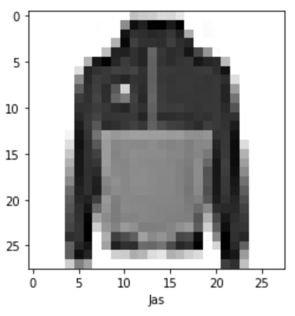

# Deel 2 - opgaveset 3

## Inleiding
Deze set staat in het teken van [TensorFlow](https://www.tensorflow.org/) en [Keras](https://keras.io/). Tot nu toe hebben we de programmacode die bij de wiskunde hoorde zelf uitgeprogrammeerd, maar in de praktijk zul je dat niet heel vaak tegenkomen. Omdat de wiskunde behoorlijk complex kan worden, en feitelijk toch altijd min of meer hetzelfde is, zijn deze twee frameworks ontwikkeld om dergelijke implementatiedetails te abstraheren. Door deze (en vergelijkbare – er zijn er meer) frameworks te gebruiken, is het voor de ontwikkelaar mogelijk om zich te richten op de daadwerkelijke architectuur en optimalisatie-strategieën.

In de eerste deelopgave gaan we werken met een standaard-dataset, die in TensorFlow is ingebakken, om een netwerk te trainen. De tweede deelopgave gaat op basis van dit netwerk een *confusion matrix* uitrekenen en tekenen.

De startcode en andere bestanden die bij deze opgave horen kun je [hier downloaden](../files/startcode_deel2-set3.zip). Net als bij de vorige twee sets is er een bestand `exercise3.py`, dat het bestand `uitwerkingen.py` gebruikt. Het is de bedoeling dat je dit laatste bestand afmaakt.

## Opgave: de fashion MNIST
Eerder hebben we gewerkt met de MNIST-dataset, die handschriften van een paar duizend scholieren bevatte. Deze week gebruiken we een andere, vergelijkbare dataset, namelijk [de fashion-MNIST](https://github.com/zalandoresearch/fashion-mnist). Deze set bevat afbeeldingen van mode-items, zoals broeken, jurken en schoenen. De set bevat 60.000 trainingsplaatjes en 10.000 testplaatjes. Elk plaatje is een 28 &times; 28 grayscale plaatje.

Het bestand `exercise3.py` begint met het inladen van een aantal *dependencies* en laadt vervolgens de dataset in. Deze zit [standaard in TensorFlow](https://www.tensorflow.org/datasets/catalog/fashion_mnist) – bestudeer het script om hier een beeld van te krijgen. Het laden van de data kan de eerste keer even duren (uiteraard afhankelijk van de snelheid van je *downstream*). Als de data geladen is, worden de dimensies van de verschillende datasets uitgeprint.

### Opgave 1a: het visualiseren en prepareren van de data
Zoals altijd beginnen we met het visualiseren van de data. Maak de methode `plot_image()` in `uitwerkingen` af. Deze methode krijgt een array van 28 &times; 28 als parameter mee en maakt gebruik van `pyplotlib` om hier een plaatje van te tekenen; ook wordt het label dat met het plaatje correspondeert aan de methode meegegeven. Zorg ervoor dat dit label onderaan het plaatje komt te staan. Het script `exercise3.py` roept deze methode aan met een willekeurige sample uit de dataset, zodat je eenvoudig kunt controleren of het plaatje correspondeert met het label.

Net als de vorige weken kun je het tekenen van het plaatje vervolgens overslaan door de parameter `skip` aan het script mee te geven.

### Opgave 1b: aanpassen van data
Als je de data van de plaatjes bestudeert, zie je dat de getallen waaruit deze zijn opgemaakt liggen in de range van 0-255. Om deze goed door een neuraal netwerk te laten verwerken, is het van belang deze range om te zetten in getallen tussen de nul en de één. Implementeer de methode `scale_data()`, zodat de waarden van de getallen in de daaraan meegegeven matrix omgezet worden in de range 0-1. Zorg er daarbij voor, dat hier een willekeurige matrix aan kan worden meegegeven (dus ook één, waarbij de range van de oorsponkelijke waarden ligt tussen 0 en 1024). Maak gebruik van de numpy-methode <a href="https://docs.scipy.org/doc/numpy/reference/generated/numpy.amax.html">amax</a> om het hoogste getal in de meegegeven matrix te bepalen.

Als je deze methode hebt geïmplementeerd, roept het script `exercise3.py` hem aan, zodat je kunt controleren of het klopt. Vervolgens wordt deze methode aangeroepen met `train_images` en `test_images`.

### Opgave 1c: Het maken van het model
Nu we de data hebben voorbereid, is het tijd om het model te maken. Tijdens de theorieles is ingegaan op de manier waarop je met Keras moet werken: dat moet je bij deze opgave toepassen. Maak in de methode `build_model` een netwerk met drie lagen: een input-laag die de plaatjes van 28&times;28 omzet in 784 input-nodes; een tweede laag van 128 nodes die volledig verbonden is met de input-laag; en een derde laag met tien output-nodes. Geef aan de verborgen middelste laag een <a href="https://www.tensorflow.org/api_docs/python/tf/nn/relu">tf.nn.relu</a>-activatie mee, en in de output-laag een <a href="https://www.tensorflow.org/api_docs/python/tf/nn/softmax">tf.nn.softmax</a>. 

Het kan zijn dat je wat `deprecation-warnings` krijgt bij het aanmaken van dit model (afhankelijk van de versie van TensorFlow die je gebruikt). Die kun je gevoegelijk negeren.

Het model moet verder voorzien worden van een aantal parameters:

- De *optimizer*, die aangeeft hoe het model wordt geüpdate op basis van de data en de *loss-function*.

- De *loss-function*, die aangeeft hoe de accuratesse van het model gedurende de trainingsronden wordt bepaald. 

- De *metrics*, waarmee de training en de tests worden gemonitord.

Geef deze parameters respectievelijk de waarden `adam`, `sparse_categorical_crossentropy`, en `accuracy`. Bestudeer [de documentatie](https://www.tensorflow.org/api_docs/python/tf/keras/Sequential#compile) voor nadere specificaties hiervan. Retourneer het model vanuit de methode `build_model()`.

Wanneer deze opgave is afgerond, kun je het script `exercise3.py` opnieuw runnen. Hier wordt nu de methode `fit` op het model aangeroepen om het te trainen.

In de volgende opgaveset gaan we vervolgens in op het bepalen van de kwaliteit van het getrainde netwerk. Maak hiervoor de methode `save_model()` af, zodat het getrainde model op een locatie op je lokale computer wordt opgeslagen. Bestudeer eventueel [de documentatie](https://scikit-learn.org/stable/model_persistence.html) om te zien hoe je dit doet.